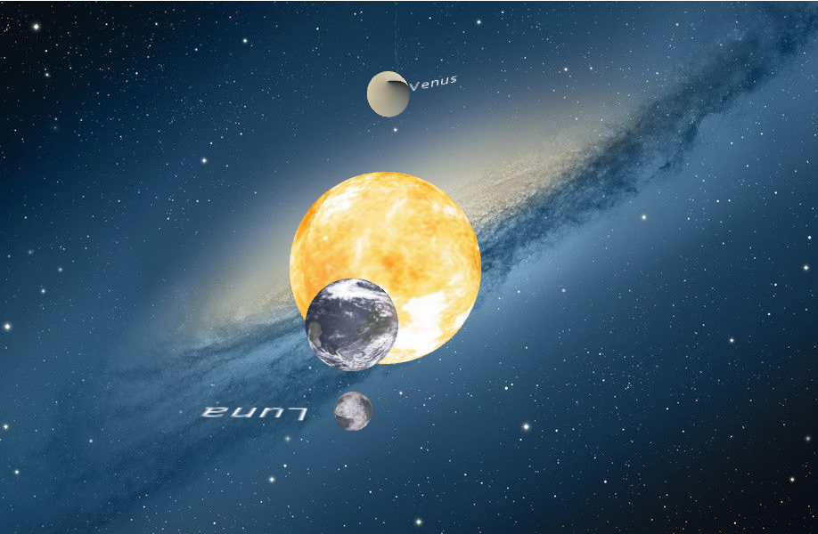

<!-- TABLE OF CONTENTS -->
<details open="open">
  <summary>Tabla de contenidos</summary>
  <ol>
    <li>
      <a href="#Autor">Autor</a>
    </li>
    <li>
      <a href="#Trabajo realizado">Trabajo realizado</a>
    </li>
    <li><a href="#decisiones-adoptadas">Decisiones adoptadas</a></li>
    <li><a href="#referencias">Referencias</a></li>
    <li><a href="#herramientas">Herramientas</a></li>
    <li><a href="#resultado">Resultado</a></li>
  </ol>
</details>


## Autor

El autor de este proyecto es el estudiante Alejandro Daniel Herrera Cárdenes para la asignatura Creando Interfaces de Usuario (CIU) para el profesor Modesto Fernando Castrillón Santana. 


## Trabajo realizado

El trabajo se basa en hacer un sistema planetario que contenga una nave que tenga movimiento en el programa Processing.

## Decisiones adoptadas

Las mayores decisiones tomadas y las que mas pruebas requirieron fue realizar la "primera persona" de la nave con movimiento


* Método que permite el movimiento de la cámara en modo "primera persona"
  ```
  void updateShipCamera(){
    if (wPressed) {
      posicion.add(PVector.mult(direccion, 5));
    }
    if (sPressed) {
      posicion.sub(PVector.mult(direccion, 5));
    }  
    if (aPressed) {
      PVector producto = new PVector();
      PVector.cross(direccion, vertical, producto);
      producto.normalize();
      posicion.sub(PVector.mult(producto, 5));
    }
     
    if (dPressed) {
      PVector producto = new PVector();
      PVector.cross(direccion, vertical, producto);
      producto.normalize();
      posicion.add(PVector.mult(producto, 5));
    }
    if(upPressed){
      y -= 1;
      y = y % 360;
    }
    if(downPressed){
      y += 1;
      y = y % 360;
    }
    if(leftPressed){
      x -= 1;
      x = x % 360;
    }
    if(rigthPressed){
      x += 1;
      x = x % 360;
    }
    PVector dir = new PVector(
       cos(radians(x)) * cos(radians(y)),
       sin(radians(y)),
       sin(radians(x)) * cos(radians(y))
    );
    dir.normalize();
    direccion = dir;
  }
  if(mode){
     updateShipCamera();
     PVector dir = PVector.add(posicion,direccion);
     camera(posicion.x,posicion.y,posicion.z,
           dir.x,dir.y,dir.z,
           vertical.x,vertical.y,vertical.z);
    pushMatrix();
     translate(posicion.x,posicion.y,posicion.z);
     popMatrix();
   }else{
     camera();
   }

 <p align="center"></br>Pantalla final</p>
 


## Referencias

Para ayudarme en la realización de esta aplicación usé la API que te proporciona [Processing](https://www.processing.org/).

* [Documentación de clase](https://ncvt-aep.ulpgc.es/cv/ulpgctp21/pluginfile.php/412240/mod_resource/content/40/CIU_Pr_cticas.pdf).

* [Processing](https://www.processing.org/)


## Resultado

Añado un GIF con el resultado de la aplicación final con el sistema planetario.

  * Resultado
  <p align="center"></br>Gif resultado final</p>
